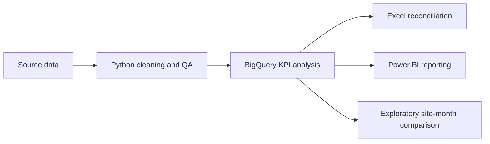

# MarginOps

### Commercial finance & FP&A analytics for hospitality operations

An end-to-end portfolio project turning hospitality-style trading and guest-review data into documented commercial KPIs, a reconciliation workflow and a Power BI report.

**Project status: complete** · **Analysis:** Python, BigQuery SQL · **Reconciliation:** Excel · **Reporting:** Power BI

---

## Executive summary

MarginOps explores the trading performance of five hospitality sites and tests whether monthly revenue and guest-review ratings move together. The project covers **7,500 site/date/shift trading records** and **1,171 individual guest reviews**. It began as a way to connect my hospitality operations experience with my BSc in FinTech with Data Analytics.

The analysis found spend per cover of approximately **£13.25–£13.50** and gross margin of **65.1%–66.1%** across sites under the stated SQL eligibility rules. Average review ratings ranged from **3.57 to 3.72**. An exploratory site/month comparison produced a revenue-to-rating correlation of **-0.079**; this is a descriptive result, not evidence of cause and effect.

> Revenue basis, duplicate trading keys and review-date timing remain important limitations. See [methodology and limitations](docs/methodology.md) before interpreting the results.

## Project workflow

## Questions explored

- How do sales, covers, spend per cover, cost of sales, gross margin, wastage and forecast variance differ by site?
- How do trading summaries vary by shift, weekday and month?
- How do valid ratings and review volumes vary across sites and platforms?
- What association, if any, appears when trading and review data are compared at a shared site/month grain?

## Tools and methods

| Stage | Tools | Work demonstrated |
|---|---|---|
| Clean and validate | Python, pandas | Preserve raw data; standardise labels; parse dates; flag missingness, invalid ratings and duplicates |
| Analyse | BigQuery SQL | Conditional aggregation, KPI-specific eligibility, CTEs, window functions, ranking and monthly views |
| Reconcile | Excel | Trace and reconcile summary calculations |
| Communicate | Power BI | Present commercial KPIs and site comparisons |

## Repository guide

| Path | Contents |
|---|---|
| [`analysis/site_trading.sql`](analysis/site_trading.sql) | Trading data checks and commercial KPIs |
| [`analysis/guest_reviews.sql`](analysis/guest_reviews.sql) | Rating, review-volume and data-quality analysis |
| [`analysis/combined_review_trading.sql`](analysis/combined_review_trading.sql) | Monthly views, join coverage and exploratory correlation |
| [`docs/methodology.md`](docs/methodology.md) | Grain, eligibility and interpretation limits |
| [`docs/findings_and_limits.md`](docs/findings_and_limits.md) | Findings, unresolved checks and publication caveats |
| [`data/README.md`](data/README.md) | Data handling and reproduction guidance |
| [`visuals/README.md`](visuals/README.md) | Power BI artifact and public-release notes |

## Analytical principles

- Each KPI defines its own eligible rows; one metric’s exclusions do not silently affect another.
- Missing values and ambiguous negatives are not automatically treated as zero.
- Rating averages are reported with their supporting review counts.
- Trading and review data are aggregated separately to site/month before joining, preventing row multiplication across different grains.
- Results are descriptive. Association is not causation.

## Reproduce the SQL

The scripts use BigQuery Standard SQL. Load compatible tables into your own dataset and replace `YOUR_PROJECT_ID.YOUR_DATASET` with your BigQuery project and dataset. Table and field names should match the schema described in the scripts. Saved query outputs and row-level source records are intentionally excluded from this public repository.

## Data and privacy

The public repository contains analysis logic and documentation, not raw records or guest review text. The interactive Power BI file is also excluded from this initial release because it can embed underlying data. A static report will only be published after its pages and detailed values have been checked for public release.

## About this project

MarginOps is a personal learning and portfolio project. It demonstrates an applied analytics workflow and commercial reasoning; it is not an official report for an employer or venue.
