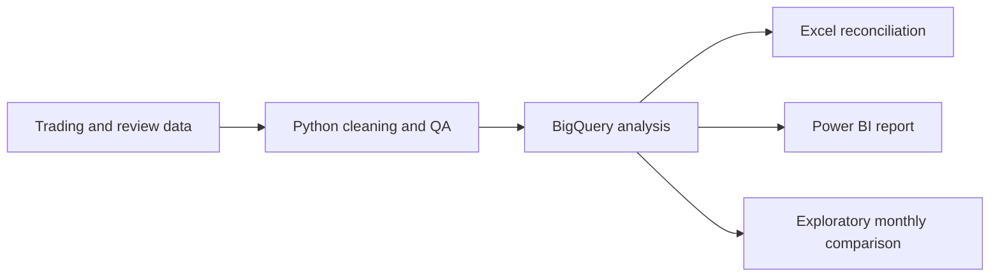

# MarginOps

### Commercial finance and FP&A analysis for hospitality operations

An end-to-end portfolio project turning hospitality trading and guest-review data into documented commercial KPIs, analysis and a Power BI report.

**Status: complete** · **Data:** site trading and guest reviews · **Tools:** Python, BigQuery SQL, Excel and Power BI

---

## Executive summary

MarginOps analyses **7,500 site/date/shift trading records** and **1,171 guest reviews** across five sites. It connects my hospitality operations experience with my BSc in FinTech with Data Analytics.

Using the same row eligibility as the submitted SQL and Excel work, the five site-level forecast results sum to **£6.028m actual revenue** against **£5.896m forecast**, a net variance of **+£132.3k (+2.24%)**. The SQL did not use duplicate flags to filter trading rows. Gross margin ranged from **65.14% to 66.13%** across sites. Guest-review SQL reported site averages from **3.58 to 3.72**, and the exploratory site/month revenue-rating correlation was **-0.079**.

The report answers the commercial questions the final two datasets can support and identifies labour questions that remain outside this project's scope. See [business questions and answers](docs/business_questions.md).

## Workflow

## What the analysis found

- The net forecast variance was positive overall, but net bias alone is not a full forecast-accuracy measure. The original analysis did not calculate WAPE or another absolute-error metric.
- Dinner and weekends showed the strongest positive forecast variances; Tuesday was below forecast in the weekday breakdown.
- Site gross-margin percentages were close together. The submitted analysis did not decompose the differences into product-mix or category-level COGS drivers.
- The wastage-rate result needs reconciliation: the SQL and Excel files use different numerator populations. The public findings flag this instead of presenting a single rate as settled.
- Review averages varied little across sites and platforms. Reviewers are self-selected, and the recorded date is not confirmed as the visit date.

## Business questions

The original draft also listed questions about labour budgets and revenue per labour hour. The completed MarginOps release contains trading and review data only; it does not contain staff timesheets or a labour budget. Those questions are marked out of scope rather than answered by inference.

## Tools and methods

| Stage | Tools | Work demonstrated |
|---|---|---|
| Clean and validate | Python, pandas | Standardised labels, parsed dates and added missingness, validity and duplicate flags |
| Analyse | BigQuery SQL | KPI-specific eligibility, conditional aggregation, CTEs, window functions and monthly views |
| Reconcile | Excel | Compared core outputs; wastage-rate numerator still needs reconciliation |
| Communicate | Power BI | Presented commercial KPIs and site comparisons |

## Repository guide

| Path | Contents |
|---|---|
| [`analysis/business_question_answers.sql`](analysis/business_question_answers.sql) | Reproducible calculations using the submitted SQL eligibility rules |
| [`analysis/site_trading.sql`](analysis/site_trading.sql) | Trading data checks and KPI analysis |
| [`analysis/guest_reviews.sql`](analysis/guest_reviews.sql) | Review quality, rating and volume analysis |
| [`analysis/combined_review_trading.sql`](analysis/combined_review_trading.sql) | Monthly views, join coverage and exploratory comparison |
| [`docs/business_questions.md`](docs/business_questions.md) | Direct answers, evidence and out-of-scope questions |
| [`docs/methodology.md`](docs/methodology.md) | Grain, eligibility and interpretation limits |
| [`docs/findings_and_limits.md`](docs/findings_and_limits.md) | Findings and remaining evidence gaps |
| [`data/README.md`](data/README.md) | Data handling and reproduction guidance |
| [`visuals/README.md`](visuals/README.md) | Power BI artifact and public-release notes |

## Analytical principles

- Each KPI defines its own eligible rows; one metric's exclusions do not silently affect another.
- Missing values and ambiguous negatives are not automatically treated as zero.
- The raw cleaned table is preserved. Trading duplicate flags are QA fields; the submitted KPI SQL does not use them to exclude rows.
- Rating averages are shown with eligible review counts.
- Trading and reviews are aggregated separately to site/month before joining.
- Results are descriptive. Association is not causation.

## Reproduce the SQL

The scripts use BigQuery Standard SQL. Load compatible tables into your own dataset and replace `YOUR_PROJECT_ID.YOUR_DATASET` with your BigQuery project and dataset. Table and field names should match the supplied project schemas. Source-level data, employee information, guest text and saved row-level outputs are not published.

## Data and privacy

This public repository contains analysis code and documented aggregate findings, not raw records or guest text. The interactive `.pbix` file and PDF export are not included because they contain named-site figures and detailed trading rows. They can be prepared for release separately after anonymisation or public-data approval.

## About

MarginOps is a personal portfolio project demonstrating applied analytics and commercial reasoning. It is not an official report for an employer or venue.
