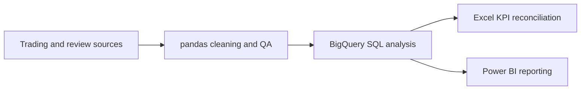

# MarginOps

### Commercial trading and guest-review analysis for hospitality

MarginOps is my first end-to-end data analytics project. I used hospitality operations data to build a workflow across **pandas, BigQuery SQL, Excel and Power BI**, then checked that the headline KPIs reconciled across tools.

## Results at a glance

The completed analysis covers 7,500 site/date/shift trading rows and 1,171 guest reviews across five sites. The reconciled trading results are **£6,027,795 actual revenue**, **£5,895,524 forecast revenue**, and **+£132,271 (+2.24%) net variance**. Gross margin is **65.32%** overall. Wastage is **5.71% of food revenue** when both numerator and denominator use open shifts with complete revenue and recorded wastage.

The cleaning audit found 60 rows in repeated site/date/shift keys (30 pairs). Values match within each pair, so the SQL and Power BI KPI policy retains the rows, consistent with the submitted Excel analysis. See [methodology](docs/methodology.md) and [findings and limits](docs/findings_and_limits.md) for definitions and caveats.

## Workflow

## Project pipeline

| Stage | Evidence in this repository |
|---|---|
| Clean and validate | [Trading cleaning notebook](cleaning/site_trading_cleaning.ipynb) and [guest-review cleaning notebook](cleaning/guest_reviews_cleaning.ipynb); code and notes only, with saved outputs removed |
| Analyse | [Trading SQL](analysis/site_trading.sql), [review SQL](analysis/guest_reviews.sql), [combined analysis](analysis/combined_review_trading.sql), and [business-question queries](analysis/business_question_answers.sql) |
| Reconcile | [Excel reconciliation notes](excel/README.md) document the matched KPI definitions and aggregate cross-tool checkpoint |
| Communicate | [Power BI release notes](visuals/README.md) describe the six-page report and the public-data handling decision |

## Questions answered

The project answers questions supported by trading and guest-review data: site and shift performance, revenue versus forecast, gross margin, wastage, review ratings, and an exploratory monthly revenue/rating comparison. **Staff timesheets and labour analysis are not part of this project.** Labour-budget and revenue-per-labour-hour questions remain out of scope.

## Interpretation limits

- Net forecast variance is not a forecast-accuracy metric; WAPE/MAE was not calculated.
- Source revenue basis (VAT, discounts, service charge and tips) is unconfirmed.
- The Wellington's Sep–Oct 2025 dip is attributed to a refurbishment closure in the supplied notes.
- August 2026 is partial through 17 August; it should not be compared with a full month.
- Reviews are self-selected, and review dates are not confirmed visit dates. The site/month correlation is descriptive, not causal.
- Monthly totals have not been normalized for trading days.

## Data and public-release policy

Row-level trading records, guest review text, the Excel source workbook and the PBIX are not committed. The workbook contains a full cleaned-data sheet, and the PBIX embeds its model data. The repository therefore contains code-only cleaning notebooks and aggregate findings, not the underlying source rows or an extractable Power BI data model. Add only an explicitly sanitized, authorized public export.

The cleaning notebooks expect authorized source files at `data/raw/site_trading.csv` and `data/raw/guest_reviews.csv`; generated outputs are written to `data/cleaned/`. Those folders are ignored by Git. Configure your own BigQuery tables and replace `YOUR_PROJECT_ID.YOUR_DATASET` in the SQL scripts before running them.

## Repository guide

- `cleaning/` — pandas cleaning and QA notebooks
- `analysis/` — BigQuery SQL
- `docs/` — methodology, business answers, and limits
- `excel/` — reconciliation definitions and aggregate checkpoint
- `visuals/` — Power BI release notes
- `data/README.md` — data scope and handling

MarginOps is a personal portfolio project, not an official report for any employer or venue.
